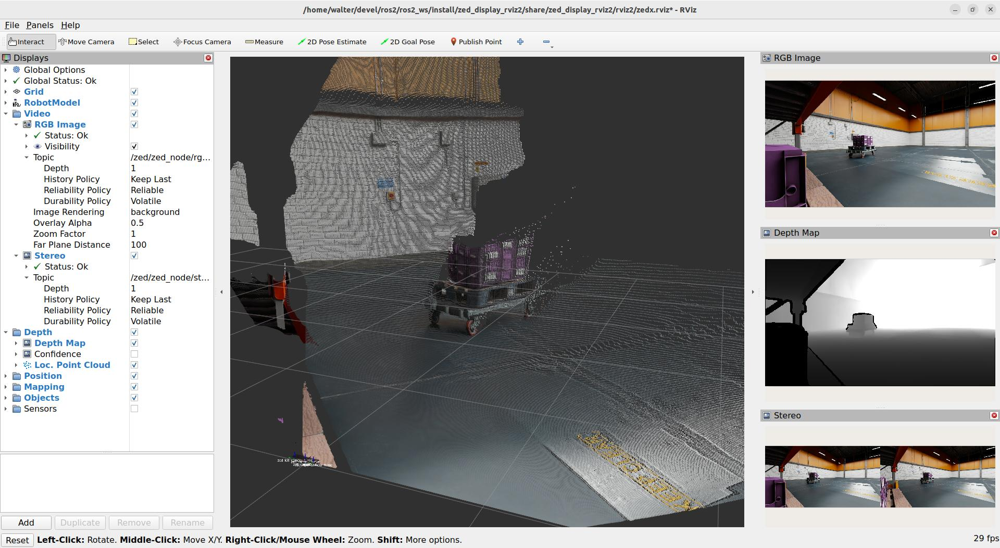
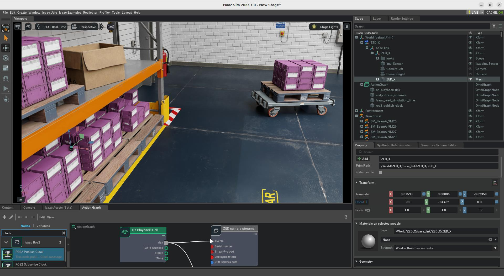
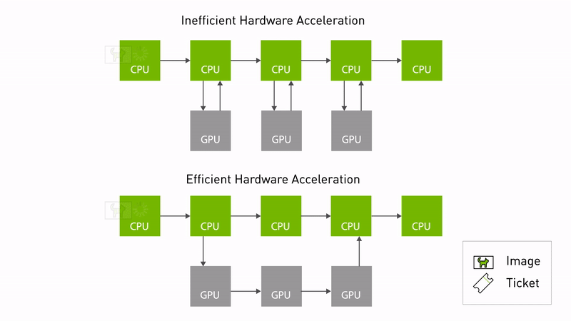

<h1 align="center">
   <br \>
   ROS 2 wrapper
</h1>

<p align="center">
  ROS 2 packages for using Stereolabs ZED Camera cameras.<br>
  ROS 2 Foxy Fitzroy (Ubuntu 20.04) - ROS 2 Humble Hawksbill (Ubuntu 22.04) - ROS 2 Jazzy Jalisco (Ubuntu 24.04)
</p>

<hr>

This package enables the use of ZED cameras with ROS 2, providing access to a variety of data types, including:

- Color and grayscale images, both rectified and unrectified
- Depth data
- Colored 3D point clouds
- Position and mapping, with optional GNSS data fusion
- Sensor data
- Detected objects
- Human skeleton data
- And more...

[More information](https://www.stereolabs.com/docs/ros2)


## Installation

### Prerequisites

- [Ubuntu 20.04 (Focal Fossa)](https://releases.ubuntu.com/focal/), [Ubuntu 22.04 (Jammy Jellyfish)](https://releases.ubuntu.com/jammy/), or [Ubuntu 24.04 (Noble Numbat)](https://releases.ubuntu.com/noble/)
- [ZED SDK](https://www.stereolabs.com/developers/release/latest/) v5.1 (to support older versions please check the [releases](https://github.com/stereolabs/zed-ros2-wrapper/releases))
- [CUDA](https://developer.nvidia.com/cuda-downloads) dependency
- ROS 2 Foxy Fitzroy (deprecated), ROS 2 Humble Hawksbill, or ROS 2 Jazzy Jalisco:
  - [Foxy on Ubuntu 20.04](https://docs.ros.org/en/foxy/Installation/Linux-Install-Debians.html) [**Not recommended. EOL reached**]
  - [Humble on Ubuntu 22.04](https://docs.ros.org/en/humble/Installation/Linux-Install-Debians.html) [EOL May 2027]
  - [Jazzy Jalisco on Ubuntu 24.04](https://docs.ros.org/en/jazzy/Installation/Linux-Install-Debians.html) [EOL May 2029]

### Build the package

The **zed_ros2_wrapper** is a [colcon](http://design.ros2.org/articles/build_tool.html) package.

> :pushpin: **Note:** If you haven’t set up your colcon workspace yet, please follow this short [tutorial](https://index.ros.org/doc/ros2/Tutorials/Colcon-Tutorial/).

To install the **zed_ros2_wrapper**, open a bash terminal, clone the package from GitHub, and build it:

```bash
mkdir -p ~/ros2_ws/src/ # create your workspace if it does not exist
cd ~/ros2_ws/src/ #use your current ros2 workspace folder
git clone https://github.com/stereolabs/zed-ros2-wrapper.git
cd ..
sudo apt update
rosdep update
rosdep install --from-paths src --ignore-src -r -y # install dependencies
colcon build --symlink-install --cmake-args=-DCMAKE_BUILD_TYPE=Release --parallel-workers $(nproc) # build the workspace
echo source $(pwd)/install/local_setup.bash >> ~/.bashrc # automatically source the installation in every new bash (optional)
source ~/.bashrc
```

> :pushpin: **Note:** the dependency `zed_msgs` is no longer installed as a submodule of this package, but is available through `apt` as a binary package with ROS 2 Humble. When working with ROS 2 Foxy, or other distributions, you can install it from the sources from the [zed-ros2-interfaces repository](https://github.com/stereolabs/zed-ros2-interfaces?tab=readme-ov-file#install-the-package-from-the-source-code).

> :pushpin: **Note:** If `rosdep` is missing, you can install it with:
>
>`sudo apt-get install python3-rosdep python3-rosinstall-generator python3-vcstool python3-rosinstall build-essential`

> :pushpin: **Note:** When using the ZED ROS 2 Wrapper on an NVIDIA Jetson with JP6, you may get the following error when building the package for the first time
>
> ```bash
> CMake Error at /usr/share/cmake-3.22/Modules/FindCUDA.cmake:859 (message):
>   Specify CUDA_TOOLKIT_ROOT_DIR
> Call Stack (most recent call first):
>  /usr/local/zed/zed-config.cmake:72 (find_package)
>  CMakeLists.txt:81 (find_package)
> ```
>
> You can fix the problem by installing the missing `nvidia-jetpack` packages:
>
> `sudo apt install nvidia-jetpack nvidia-jetpack-dev`
>
> :pushpin: **Note:** The option `--symlink-install` is very important, it allows the use of symlinks instead of copying files to the ROS 2 folders during the installation, where possible. Each package in ROS 2 must be installed, and all the files used by the nodes must be copied into the installation folders. Using symlinks allows you to modify them in your workspace, reflecting the modification during the next executions without issuing a new `colcon build` command. This is true only for all the files that don't need to be compiled (Python scripts, configurations, etc.).
>
> :pushpin: **Note:** If you are using a different console interface like zsh, you have to change the `source` command as follows: `echo source $(pwd)/install/local_setup.zsh >> ~/.zshrc` and `source ~/.zshrc`.

## Starting the ZED node

> :pushpin: **Note:** we recommend reading [this ROS 2 tuning guide](https://www.stereolabs.com/docs/ros2/150_dds_and_network_tuning) to improve the ROS 2 experience with ZED.

To start the ZED node, open a bash terminal and use the [CLI](https://index.ros.org/doc/ros2/Tutorials/Introspection-with-command-line-tools/) command `ros2 launch`:

```bash
ros2 launch zed_wrapper zed_camera.launch.py camera_model:=<camera_model>
```

Replace `<camera_model>` with the model of the camera that you are using: `'zed'`, `'zedm'`, `'zed2'`, `'zed2i'`, `'zedx'`, `'zedxm'`, `'zedxhdrmini'`, `'zedxhdr'`, `'zedxhdrmax'`, `'virtual'`,`'zedxonegs'`,`'zedxone4k'`,`'zedxonehdr'`.

The `zed_camera.launch.py` is a Python launch script that automatically starts the ZED node using ["manual composition"](https://index.ros.org/doc/ros2/Tutorials/Composition/). The parameters for the indicated camera model are loaded from the relative "YAML files."
A Robot State Publisher node is started to publish the camera static links and joints loaded from the URDF model associated with the camera model.

> :pushpin: **Note:** You can set your configurations by modifying the parameters in the files **common_stereo.yaml**, **zed.yaml** **zedm.yaml**, **zed2.yaml**, **zed2i.yaml**, **zedx.yaml**, **zedxm.yaml**, **common_mono.yaml**, **zedxonegs.yaml**, **zedxone4k.yaml**, **zedxonehdr.yaml**  available in the folder `zed_wrapper/config`.

You can get the list of all the available launch parameters by using the `-s` launch option:

```bash
ros2 launch zed_wrapper zed_camera.launch.py -s
ros2 launch zed_display_rviz2 display_zed_cam.launch.py -s
```

For full descriptions of each parameter, follow the complete guide [here](https://www.stereolabs.com/docs/ros2/zed_node#configuration-parameters).

### RViz visualization

To start a pre-configured RViz environment and visualize the data of all ZED cameras, we provide in the [`zed-ros2-examples` repository](https://github.com/stereolabs/zed-ros2-examples/tree/master/zed_display_rviz2). You'll see more advanced examples and visualizations that demonstrate depth, point clouds, odometry, object detection, etc.

You can also quickly check that your depth data is correctly retrieved in RViz with `rviz2 -d ./zed_wrapper/config/rviz2/<your camera model>.rviz`. RViz subscribes to numerous ROS topics, which can potentially impact the performance of your application compared to when it runs without RViz.

### Simulation mode

> :pushpin: **Note:** This feature is incompatible with the ZED X One and the older first-generation ZED cameras.

Launch a standalone ZED ROS 2 node with simulated ZED data as input by using the following command:

```bash
ros2 launch zed_wrapper zed_camera.launch.py camera_model:=zedx sim_mode:=true
```

Launch options:

- [Mandatory] `camera_model`: indicates the model of the simulated camera. It's required that this parameter match the model of the simulated camera. In most cases, it will be a ZED X, since the first versions of the simulation plugins that we released are simulating this type of device.
- [Mandatory] `sim_mode`: start the ZED node in simulation mode if `true`.
- [Optional] `use_sim_time`: force the node to wait for valid messages on the topic `/clock`, and so use the simulation clock as the time reference.
- [Optional] `sim_address`: set the address of the simulation server. The default is `127.0.0.1`, and it's valid if the node runs on the same machine as the simulator.
- [Optional] `sim_port`: set the port of the simulation server. It must match the value of the field `Streaming Port` of the properties of the `ZED camera streamer` Action Graph node. A different `Streaming Port` value for each camera is required in multi-camera simulations.

You can also start a preconfigured instance of `rviz2` to visualize all the information available in the simulation by using the command:

```bash
ros2 launch zed_display_rviz2 display_zed_cam.launch.py camera_model:=zedx sim_mode:=true
```

The `display_zed_cam.launch.py` launch file includes the `zed_camera.launch.py` launch file, hence it gets the same parameters.

Here's an example of `rviz2` running with the simulated information obtained by placing the ZED camera on a shelf of a simulated warehouse:





Supported simulation environments:

- [NVIDIA Omniverse Isaac Sim](https://www.stereolabs.com/docs/isaac-sim/)

## More features

### Point Cloud Transport

The ZED ROS 2 Wrapper supports [Point Cloud Transport](http://wiki.ros.org/point_cloud_transport) to publish point clouds using different compression methods.

This feature is available only if the package `point_cloud_transport` is installed in your ROS 2 environment; otherwise, it will be disabled automatically.

To install the packages, use the command:

```bash
sudo apt install ros-$ROS_DISTRO-point-cloud-transport ros-$ROS_DISTRO-point-cloud-transport-plugins
```

:pushpin: **Note:** We removed the `point_cloud_transport` package as a required dependency of the ZED ROS 2 Wrapper to avoid forcing its installation in all the environments where the ZED ROS2 Wrapper is used. If you want to use this feature, you must install the package manually.

### SVO recording

[SVO recording](https://www.stereolabs.com/docs/video/recording/) can be started and stopped while the ZED node is running using the service `start_svo_recording` and the service `stop_svo_recording`.
[More information](https://www.stereolabs.com/docs/ros2/zed_node/#services)

### Object Detection

> :pushpin: **Note:** This feature is incompatible with the ZED X One and the older first-generation ZED cameras.

Object Detection can be enabled *automatically* when the node starts by setting the parameter `object_detection/od_enabled` to `true` in the file `common_stereo.yaml`.
The Object Detection can be enabled/disabled *manually* by calling the services `enable_obj_det`.

You can find a detailed explanation of the Object Detection module in the [ZED ROS 2 documentation](https://www.stereolabs.com/docs/ros2/object-detection).

### Custom Object Detection with YOLO-like ONNX model file

> :pushpin: **Note:** This feature is incompatible with the ZED X One and the older first-generation ZED cameras.

Object Detection inference can be performed using a **custom inference engine** in YOLO-like ONNX format.

You can generate your ONNX model by using Ultralytics YOLO tools.

Install Ultralytics YOLO tools:

```bash
python -m pip install ultralytics
```

If you have already installed the `ultralytics` package, we recommend updating it to the latest version:

```bash
pip install -U ultralytics
```

Export an ONNX file from a YOLO model (more info [here](https://docs.ultralytics.com/modes/export/)), for example:

```bash
yolo export model=yolo11n.pt format=onnx simplify=True dynamic=False imgsz=640
```

For a custom-trained YOLO model, the weight file can be changed, for example:

```bash
yolo export model=yolov8l_custom_model.pt format=onnx simplify=True dynamic=False imgsz=512
```

Please refer to the [Ultralytics documentation](https://github.com/ultralytics/ultralytics) for details.

Modify the `common_stereo.yaml` parameters to match your configuration:

- Set `object_detection.model` to `CUSTOM_YOLOLIKE_BOX_OBJECTS`

Modify the `custom_object_detection.yaml` parameters to match your configuration.

> :pushpin: **Note:** The first time the custom model is used, the ZED SDK optimizes it to get the best performance from the GPU installed on the host. Please wait for the optimization to complete. When using Docker, we recommend using a shared volume to store the optimized file on the host and perform the optimization only once.

Console log while optimization is running:

```bash
[zed_wrapper-3] [INFO] [1729184874.634985183] [zed.zed_node]: === Starting Object Detection ===
[zed_wrapper-3] [2024-10-17 17:07:55 UTC][ZED][INFO] Please wait while the AI model is being optimized for your graphics card
[zed_wrapper-3]  This operation will be run only once and may take a few minutes 
```

You can find a detailed explanation of the Custom Object Detection module in the [ZED ROS 2 documentation](https://www.stereolabs.com/docs/ros2/custom-object-detection).

### Body Tracking

> :pushpin: **Note:** This feature is incompatible with the ZED X One and the older first-generation ZED cameras.

The Body Tracking can be enabled *automatically* when the node starts by setting the parameter `body_tracking/bt_enabled` to `true` in the file `common_stereo.yaml`.

### Spatial Mapping

> :pushpin: **Note:** This feature is incompatible with the ZED X One camera.

The Spatial Mapping can be enabled automatically when the node starts setting the parameter `mapping/mapping_enabled` to `true` in the file `common_stereo.yaml`.
The Spatial Mapping can be enabled/disabled manually by calling the service `enable_mapping`.

### GNSS fusion

> :pushpin: **Note:** This feature is incompatible with the ZED X One camera.

The ZED ROS 2 Wrapper can subscribe to a `NavSatFix` topic and fuse GNSS data information
with Positional Tracking information to obtain a precise robot localization referred to Earth coordinates.
To enable GNSS fusion, set the parameter `gnss_fusion.gnss_fusion_enabled` to `true`.
You must set the correct `gnss_frame` parameter when launching the node, e.g., `gnss_frame:='gnss_link'`.
The services `toLL` and `fromLL` can be used to convert Latitude/Longitude coordinates to robot `map` coordinates.

### 2D mode

> :pushpin: **Note:** This feature is incompatible with the ZED X One camera.

For robots moving on a planar surface, activating the "2D mode" (parameter `pos_tracking/two_d_mode` in `common_stereo.yaml`) is possible.
The value of the coordinate Z for odometry and pose will have a fixed value (parameter `pos_tracking/fixed_z_value` in `common_stereo.yaml`).
Roll, Pitch, and the relative velocities will be fixed to zero.

## NVIDIA® Isaac ROS integration

The ZED ROS 2 Wrapper is compatible with the [NVIDIA® Isaac ROS](https://nvidia-isaac-ros.github.io/) framework, which provides a set of tools and libraries for building robotics applications on NVIDIA® platforms.

The ZED ROS 2 Wrapper leverages [NITROS](https://nvidia-isaac-ros.github.io/concepts/nitros/index.html) (NVIDIA® Isaac Transport for ROS) a technology to enable data streaming through NVIDIA-accelerated ROS graphs.



Read the full [Isaac ROS integration guide](https://docs.stereolabs.com/isaac-ros/) and learn how to set up your development environment to use the ZED ROS2 Wrapper with Isaac ROS and NITROS.

## Examples and Tutorials

Examples and tutorials are provided to better understand how to use the ZED wrapper and how to integrate it into the ROS 2 framework.
See the [`zed-ros2-examples` repository](https://github.com/stereolabs/zed-ros2-examples)

### RVIZ2 visualization examples

- Example launch files to start a preconfigured instance of RViz displaying all the ZED Wrapper node information: [zed_display_rviz2](https://github.com/stereolabs/zed-ros2-examples/tree/master/zed_display_rviz2)
- ROS 2 plugin for ZED2 to visualize the results of the Object Detection and Body Tracking modules (bounding boxes and skeletons): [rviz-plugin-zed-od](https://github.com/stereolabs/zed-ros2-examples/tree/master/rviz-plugin-zed-od)

### Tutorials

A series of tutorials is provided to better understand how to use the ZED nodes in the ROS 2 environment :

- [Video subscribing](https://github.com/stereolabs/zed-ros2-examples/tree/master/tutorials/zed_video_tutorial): `zed_video_tutorial` - In this tutorial, you will learn how to write a simple node that subscribes to messages of type `sensor_msgs/Image` to retrieve the Left and Right rectified images published by the ZED node.
- [Depth subscribing](https://github.com/stereolabs/zed-ros2-examples/tree/master/tutorials/zed_depth_tutorial): `zed_depth_tutorial` - In this tutorial, you will learn how to write a simple node that subscribes to messages of type `sensor_msgs/Image` to retrieve the depth images published by the ZED node and to get the measured distance at the center of the image.
- [Pose/Odometry subscribing](https://github.com/stereolabs/zed-ros2-examples/tree/master/tutorials/zed_pose_tutorial): `zed_pose_tutorial` - In this tutorial, you will learn how to write a simple node that subscribes to messages of type `geometry_msgs/PoseStamped` and `nav_msgs/Odometry` to retrieve the position and the odometry of the camera while moving in the world.
- [ROS 2 Composition + BGRA2BGR conversion](https://github.com/stereolabs/zed-ros2-examples/tree/master/tutorials/zed_rgb_convert): `zed_rgb_convert` - In this tutorial, you will learn how to use the concept of "ROS 2 Composition" and "Intra Process Communication" to write a ROS 2 component that gets a 4 channel BGRA image as input and re-publishes it as 3 channels BGR image.
- [ROS 2 Multi-Camera](https://github.com/stereolabs/zed-ros2-examples/tree/master/tutorials/zed_multi_camera): `zed_multi_camera` - In this tutorial, you will learn how to use the provided launch file to start a multi-camera robot configuration.
- [ROS 2 Multi-Camera + Intra Process Communication](https://github.com/stereolabs/zed-ros2-examples/tree/master/tutorials/zed_ipc): `zed_ipc - In this tutorial, you will learn how to use the provided launch file to start a multi-camera configuration, and load a new processing node in the same process to leverage Intra Process Communication with ROS 2composition.
- [Robot integration](https://github.com/stereolabs/zed-ros2-examples/tree/master/tutorials/zed_robot_integration): `zed_robot_integration` - In this tutorial, you will learn how to add one or more ZED cameras to a robot configuration.

### Examples

How to use the ZED ROS 2 nodes alongside other ROS 2 packages or advanced features.

- [zed_aruco_localization](https://github.com/stereolabs/zed-ros2-examples/tree/master/examples/zed_aruco_localization): Use localized ArUco tag as a reference for localization.
- [zed_depth_to_laserscan](https://github.com/stereolabs/zed-ros2-examples/tree/master/examples/zed_depth_to_laserscan): Convert ZED Depth maps into virtual Laser Scans using

## Update the local repository

To update the repository to the latest release, use the following command that will retrieve the latest commits of `zed-ros2-wrapper` and of all the submodules:

```bash
git checkout master # if you are not on the main branch  
git pull 
```

Clean the cache of your colcon workspace before compiling with the `colcon build` command to be sure that everything will work as expected:

```bash
cd <ros2_workspace_root> # replace with your workspace folder, for example ~/ros2_ws/src/
rm -r install
rm -r build
rm -r log
colcon build --symlink-install --cmake-args=-DCMAKE_BUILD_TYPE=Release --parallel-workers $(nproc)
```

## Known issues

- Nothing to report yet.

If you find a bug or want to request a new feature, please open an issue on the [GitHub issues page](https://github.com/stereolabs/zed-ros2-wrapper/issues).
