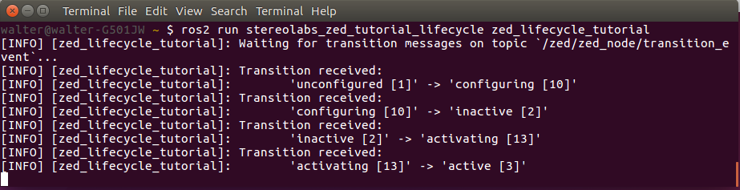

# Lifecycle Node tutorial

In this tutorial you will learn how to write a simple node that monitors the state transitions of the ZED wrapper node.

The complete documentation is available on the [Stereolabs website](https://docs.stereolabs.com/integrations/ros2/lifecycle/)

