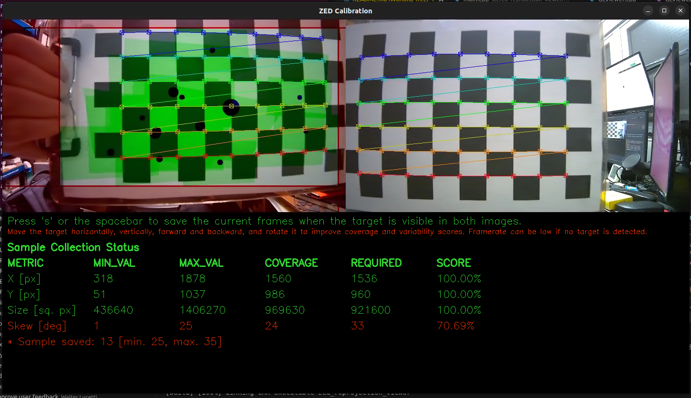

# ZED OpenCV Calibration

© 2026, Cargo Robotics.

A camera calibration toolkit for ZED cameras using OpenCV.

**Provenance:** Everything under **`stereo_calibration/`** and **`stereo_reprojection_viewer/`** (sources, headers, and those subtrees’ CMake files) is **adopted from** [Stereolabs’ upstream repository](https://github.com/stereolabs/zed-opencv-calibration), not authored as original Cargo Robotics software. Cargo maintains separate additions and forks here—such as **`config/`**, **`scripts/`**, this **README**, Docker/compose workflow notes, and occasional patches inside those trees—under our usual copyright where noted in headers. Refer to the upstream project and per-file license blocks (e.g. Stereolabs’ BSD-style header in the reprojection viewer) for third-party terms.

## Overview

This project provides two main applications for working with ZED cameras:

1. **Stereo Calibration Tool** (`zed_stereo_calibration`) — Interactive calibration data acquisition and processing.
2. **Stereo Reprojection Viewer** (`zed_reprojection_viewer`) — Real-time reprojection to validate calibration on unrectified images.

## Run on the vehicle (recommended)

Use the same ZED SDK and ROS image as the rest of the stack: start an interactive shell with the **`zed-end-effector`** service (does not launch the ROS node; `--rm` drops the container when you exit).

**GUI / X11 on the host:** `zed_stereo_calibration` and `zed_reprojection_viewer` open interactive windows. Before starting the container, run this **on the host** in the same graphical session you will use (so `DISPLAY` is valid, e.g. `:0`):

```bash
xhost +local:docker
```

That allows local Docker clients to connect to your X server. Without it, OpenCV/GL windows from the container usually fail to open.

From the repository root:

```bash
docker compose -f docker-compose-deploy.yml run --rm zed-end-effector bash
```

### 1. One-time setup inside the container

Binaries are produced by the workspace build (typical layout):

- `zed_stereo_calibration` → `/root/ros2_ws/build/zed_opencv_calibration/stereo_calibration/`
- `zed_reprojection_viewer` → `/root/ros2_ws/build/zed_opencv_calibration/stereo_reprojection_viewer/`

Put them on `PATH` (they are not there by default):

```bash
export PATH="/root/ros2_ws/build/zed_opencv_calibration/stereo_calibration:/root/ros2_ws/build/zed_opencv_calibration/stereo_reprojection_viewer:${PATH}"
```

`docker-compose-deploy.yml` bind-mounts this package at **`/opt/zed-opencv-calibration`** as well as under `src/` so **`zed_reprojection_viewer`** finds **`/opt/zed-opencv-calibration/config/fisheye_stereo.yaml`** with no extra symlink step.

### 2. Calibration data paths and YAML

`docker-compose-deploy.yml` bind-mounts **`/var/cargo/zed-calibration/images`** and **`/var/cargo/zed-calibration/calibration_config`** into the container. Point `images_dir` and `calibration_output_dir` in the YAML at those paths (see the checked-in `config/fisheye_stereo.yaml`). All calibration I/O happens **inside the container**; the mounts persist captures and `SN*.conf` / `zed_calibration_*.yml` on the vehicle under `/var/cargo/`.

If a path is missing the first time, create it from the same shell session (before running the tools):

```bash
mkdir -p /var/cargo/zed-calibration/images /var/cargo/zed-calibration/calibration_config
```

Edit **`config/fisheye_stereo.yaml`** at `/root/ros2_ws/src/zed-opencv-calibration/config/fisheye_stereo.yaml` when you use the compose bind-mount of the repo.

### 3. Run the tools

**Reprojection viewer** (after `PATH` is set):

```bash
zed_reprojection_viewer
```

**Stereo calibration**:

```bash
zed_stereo_calibration --config /root/ros2_ws/src/zed-opencv-calibration/config/fisheye_stereo.yaml
```

**Stereo calibration + prompt to install `SN*.conf`** into `/usr/local/zed/settings/` after success (asks again if the destination file already exists):

```bash
bash /root/ros2_ws/src/zed-opencv-calibration/scripts/zed_stereo_calibration_with_install_prompt.sh \
  --config /root/ros2_ws/src/zed-opencv-calibration/config/fisheye_stereo.yaml
```

**Install `SN*.conf` only** (e.g. after a run without the wrapper):

```bash
bash /root/ros2_ws/src/zed-opencv-calibration/scripts/install_conf_to_zed_settings.sh /var/cargo/zed-calibration/calibration_config
```

`/usr/local/zed/settings` in the container is the same folder as on the host, so installs persist.

**Host prerequisites:** `xhost +local:docker` (see above); ZED X GMSL stack — e.g. `nvargus-daemon` and `zed_x_daemon` running; same as the full `zed-end-effector` service. Compose passes **`DISPLAY`** into the service for GUI apps.

## Requirements

### Dependencies

- **ZED SDK** (version 5.1 or higher, aligned with the vehicle ZED image)
- **OpenCV** (4.x recommended)
- **CUDA** (compatible with ZED SDK version)
- **OpenGL libraries**: GLEW, FreeGLUT, OpenGL
- **CMake** (3.5 or higher)
- **C++17** compatible compiler

## Building the tools

### In the Cargo Robotics ZED workspace (Jetson / vehicle image)

This tree is built as part of **`colcon build`** for the ZED ROS workspace. Outputs are normally under:

`/root/ros2_ws/build/zed_opencv_calibration/stereo_calibration`  
`/root/ros2_ws/build/zed_opencv_calibration/stereo_reprojection_viewer`

If those directories are missing, rebuild the workspace from `/root/ros2_ws` (see vehicle documentation).

### Standalone CMake (optional, native dev)

Outside Docker you can build only this project, as in the upstream Stereolabs workflow:

```bash
cd zed-opencv-calibration
mkdir build && cd build
cmake ..
make -j$(nproc)
```

## Usage

### Stereo Calibration

The **Stereo Calibration Tool** is targeted at ZED XOne **GS** fisheye stereo pairs. It assumes both cameras have been factory-calibrated by Stereolabs, pulls each camera's fisheye intrinsics from the ZED SDK live, holds them **fixed**, and solves only the stereo extrinsics (R, T) with `cv::CALIB_FIX_INTRINSIC`. Mono intrinsic calibration is not performed.

#### Checkerboard Pattern Requirements

The calibration requires a printed checkerboard pattern with:

- **Default configuration**: [9×6 checkerboard with 23.5 mm squares](https://github.com/opencv/opencv/blob/4.x/doc/pattern.png/)
- **Custom patterns**: Set `checkerboard.h_edges` / `v_edges` / `square_size_mm` in the YAML config.

**Important**: The pattern dimensions refer to the number of **inner corners** (where black and white squares meet), not the number of squares.

#### Prepare the Calibration Target

- Print the checkerboard pattern maximized and attach it on a rigid, flat surface.
- Ensure the pattern is perfectly flat and well-lit.
- Avoid reflections or glare on the checkerboard surface.

#### Configure the Calibration

Edit `config/fisheye_stereo.yaml` with your camera serials, ZED SDK resolution mode, directories, and checkerboard parameters. For **`zed-end-effector`** with the default compose mounts, paths look like:

```yaml
left_sn: 305932808
right_sn: 305481469
resolution: HD1200
calibration_output_dir: "/var/cargo/zed-calibration/calibration_config"
capture_images_dir: "/var/cargo/zed-calibration/images"   # live capture writes PNG pairs here
checkerboard:
  h_edges: 9
  v_edges: 6
  square_size_mm: 23.5
images_dir: ""   # non-empty => load existing pairs from this dir and skip live capture
```

**Finding `left_sn` and `right_sn`:** Each physical ZED camera has a numeric serial used in `fisheye_stereo.yaml` and by the SDK. You can obtain it in several ways:

- **Product packaging** — Often printed on the box or included documentation for the unit.
- **Hardware** — A small label or tag on the camera body lists the serial number.
- **ZED Explorer (in the ZED container)** — With cameras connected, run the Stereolabs tool shipped with the SDK and list all devices, for example:

  ```bash
  /usr/local/zed/tools/ZED_Explorer --all
  ```

  Use the same shell as your calibration workflow (e.g. after `docker compose … run zed-end-effector bash`) so the tool sees the GMSL/USB devices. Match each serial to the **left** and **right** camera in your rig when filling in `left_sn` and `right_sn`.

Live capture uses **`capture_images_dir`** (default in code is `/var/cargo/zed-calibration/images/` if the key is omitted). **`images_dir`** is only for extrinsics-only mode from pre-collected `image_left_*.png` / `image_right_*.png`.

#### Run the Calibration

Inside the **`zed-end-effector`** shell (see [Run on the vehicle](#run-on-the-vehicle-recommended)):

```bash
export PATH="/root/ros2_ws/build/zed_opencv_calibration/stereo_calibration:/root/ros2_ws/build/zed_opencv_calibration/stereo_reprojection_viewer:${PATH}"
zed_stereo_calibration --config /root/ros2_ws/src/zed-opencv-calibration/config/fisheye_stereo.yaml
```

CLI reference:

```text
Usage: zed_stereo_calibration --config <yaml> [--images_dir <dir>] [--verbose]

  --config <yaml>      Path to the fisheye stereo calibration config (required).
                       Defines left_sn, right_sn, resolution (HD1200/HD1080/HD720/SVGA), checkerboard,
                       and an optional images_dir.
  --images_dir <dir>   Override images_dir from the config. When set (here or
                       in the config) the live capture step is skipped and
                       stereo extrinsics are solved directly from the existing
                       pairs (image_left_N.png / image_right_N.png).
  --verbose            Enable verbose output.
```

Both ZED XOne GS cameras must be connected when running the tool: the factory fisheye intrinsics are read from the SDK at startup even when re-using a directory of previously-collected pairs.

#### Calibration Process

The calibration process consists of two main phases:

1. **Data Acquisition**: Move the checkerboard in front of the camera(s) to capture diverse views. The tool provides real-time feedback on the quality of the captured data.
2. **Calibration Computation**: Once sufficient data is collected, the tool computes the calibration parameters and saves them to two files.

The **Data Acquisition** phase consists of moving the checkerboard in front of the camera(s) to capture diverse views. The tool provides real-time feedback on the quality of the captured data regarding *XY coverage*, *distance variation*, and *skewness*.

When the checkerboard is placed in a position that you want to capture, press the **Spacebar** or the **S** key to capture the images.

- If the checkerboard is detected in both images, and the captured data are different enough from the previously captured images, the data is accepted, and the quality indicators are updated.
- If the data is not accepted, a message is displayed in the GUI output indicating the reason (e.g., checkerboard not detected, not enough variation, etc.).

The blue dots that appear on the left image indicate the center of each checkerboard that has been detected and accepted so far. The size of the dots indicates the relative size of the checkerboard in the image (bigger dots mean closer to the camera).

In order to collect good calibration data, ensure that:

- The checkerboard is always fully visible in both left and right images. Corners detected in both images are highlighted with colored visual markers.
- The checkerboard moves over a wide area of the image frame. "Green" polygons appear on the left image to indicate the covered areas. When one of the 4 zones of the left image becomes fully green, the coverage requirement is met for that part of the image.
- Red areas on the side of the left frame indicate zones that are not yet covered by the checkerboard. Try to make them as small as possible.
- The checkerboard is moved closer and farther from the camera to ensure depth variation. At least one image covering almost the full left frame is required.
- The checkerboard is tilted and rotated to provide different angles.

The "X", "Y", "Size", and "Skew" percentages indicate the quality of the collected data for each criterion.

For **X** and **Y**, the minimum and maximum values correspond to the minimum and maximum position of the corner of the checkerboard closest to the image border. The COVERAGE indicates the size of the horizontal and vertical area covered by the checkerboard corners in the left image. The higher the coverage, the more the image is covered.

For **Size**, the minimum and maximum values correspond to the smallest and largest size of the checkerboard in the left image. The COVERAGE indicates the range of sizes of the checkerboard in the collected samples. A higher coverage means that the checkerboard was captured at a wider range of distances from the camera.

For **Skew**, the minimum and maximum values correspond to the minimum and maximum skewness angle of the checkerboard in the left image. The COVERAGE indicates the range of skew angles of the checkerboard in the collected samples. A higher coverage means that the checkerboard was captured at a wider range of angles. A value of 0° means the checkerboard is perfectly fronto-parallel to the camera, a theoretical maximum of 90° means the checkerboard is seen edge-on. Normally, the maximum achievable skew is around 40°.

If you cannot reach 100% for one of the metrics, be sure that it's as high as possible, and move the checkerboard in different positions to maximize the coverage by acquiring the maximum number of samples.

Here are some tips to improve each metric:

- To raise the "X" and "Y" metrics move the checkerboard to the edges and corners of the left image while keeping it fully visible in the right frame.
- To raise the "Size" metric, move the checkerboard closer and farther from the camera. You must acquire at least one image where the checkerboard is covering almost the full left image and one where it's smaller and corners are barely detected [see the image below].
- To raise the "Skew" metric, rotate the checkerboard in different angles. It's easier to obtain different skew values if the checkerboard is closer to the camera and rotated around the vertical and horizontal axes simultaneously.

The "Calibrate" process will automatically start when either of these conditions is met:

- All metrics reach 100% and the minimum number of samples is collected.
- The maximum number of samples is reached (even if not all metrics reach 100%).



For each metric, the GUI shows the following information in a table:

- **MIN_VAL**: Minimum value stored in all the samples collected so far.
- **MAX_VAL**: Maximum value stored in all the samples collected so far.
- **COVERAGE**: The difference between the MIN_VAL and MAX_VAL, representing the range of variation in the collected samples.
- **REQUIRED**: The minimum required value for the COVERAGE to consider the metric as satisfied.
- **SCORE**: The percentage score for the metric, calculated as (COVERAGE / REQUIRED) * 100%.

You can follow the steps of the calibration process in the terminal output:

1. Each camera's factory fisheye intrinsics are read from the ZED SDK and held fixed.
2. The stereo calibration is then performed to compute the extrinsic parameters (R, T) between the two cameras.

Good calibration results typically yield a stereo reprojection error below 0.5 pixels.

If any reprojection error is too high, the calibration is not accurate enough and should be redone. Before recalibrating, verify the following:

- The checkerboard is perfectly flat and securely mounted.
- The checkerboard is well-lit with even, stable lighting.
- Camera lenses are clean and free of smudges or dust.
- No reflections or glare appear on the checkerboard surface.

After a good calibration is complete, two files are generated:

- `zed_calibration_<serial_number>.yml`: Contains intrinsic and extrinsic parameters for the stereo camera setup in OpenCV format.
- `SN<serial_number>.conf`: Contains the calibration parameters in ZED SDK format.

You can use these files in your ZED SDK applications:

- [Use the `sl::InitParameters::optional_opencv_calibration_file` parameter to load the calibration from the OpenCV file](https://www.stereolabs.com/docs/api/structsl_1_1InitParameters.html#a9eab2753374ef3baec1d31960859ba19).
- Manually copy the `SN<serial_number>.conf` file to the ZED SDK calibration folder to make the ZED SDK automatically use it:

  - Linux: `/usr/local/zed/settings/`
  - Windows: `C:\ProgramData\Stereolabs\settings`
- [Use the `sl::InitParameters::optional_settings_path` to indicate to the ZED SDK where to find the custom `SN<serial_number>.conf` calibration file](https://www.stereolabs.com/docs/api/structsl_1_1InitParameters.html#aa8262e36d2d4872410f982a735b92294).

**Note:** When calibrating a virtual ZED X One stereo rig, the serial number of the virtual stereo camera is generated by the ZED SDK from the two individual camera serials. Use that virtual serial number when naming and loading calibration files.

### Stereo Reprojection Viewer

The **Stereo Reprojection Viewer** is a diagnostic tool that visualizes the effects of camera calibration in real-time. It helps validate calibration quality by displaying how 3D point cloud data reprojects onto unrectified images.

The tool opens the stereo camera and loads calibration parameters either from a specified file or from the default ZED SDK calibration location.

#### What the Viewer Displays

The application provides three synchronized views:

1. **3D Point Cloud** — The computed depth data in 3D space
2. **Rectified Left Image** — The corrected, distortion-free left camera image
3. **Unrectified Left Image with Reprojection Overlay** — The raw left camera image overlaid with reprojected 3D points color-coded by depth (blue for close, red for far)

#### Evaluating Calibration Quality

By comparing the rectified and unrectified views with the reprojection overlay, you can:

- **Assess distortion correction**: Verify how well the calibration parameters remove lens distortions
- **Compare field of view**: Evaluate differences in effective FOV between rectified and unrectified images
- **Validate depth accuracy**: Ensure 3D points align correctly with their corresponding image features

#### Virtual Stereo Camera Alignment

For virtual stereo camera setups (e.g., two ZED X One cameras), the reprojection view provides critical alignment feedback:

- **Centered reprojection zone**: Indicates proper optical axis alignment between the two cameras with minimal vertical offset
- **Minimal uncovered areas**: Suggests good lens matching and overlapping fields of view between cameras

#### Run the Reprojection Viewer

After [setting up `PATH`](#1-one-time-setup-inside-the-container) in the **`zed-end-effector`** shell (compose mounts config at `/opt/zed-opencv-calibration/config/`):

```bash
zed_reprojection_viewer
```

The viewer reads all settings from `config/fisheye_stereo.yaml` at **`/opt/zed-opencv-calibration/config/fisheye_stereo.yaml`**:

- uses `left_sn` / `right_sn`,
- regenerates the virtual stereo SN with `sl::generateVirtualStereoSerialNumber`,
- and uses `calibration_output_dir` as the ZED SDK optional settings directory.

### Helper scripts

| Script | Purpose |
|--------|---------|
| `scripts/install_conf_to_zed_settings.sh` | Interactively copy the newest `SN*.conf` from your calibration output directory to `/usr/local/zed/settings/` (confirms before overwriting an existing file). |
| `scripts/zed_stereo_calibration_with_install_prompt.sh` | Runs `zed_stereo_calibration`, then invokes the install script on success (prepends default build dirs to `PATH` if needed). |

Environment overrides (optional): `ZED_CALIB_STEREO_BUILD_DIR`, `ZED_CALIB_REPROJ_BUILD_DIR`, `ZED_OPENCV_CALIB_SRC`, `ZED_CALIB_OUTPUT_DIR`.
