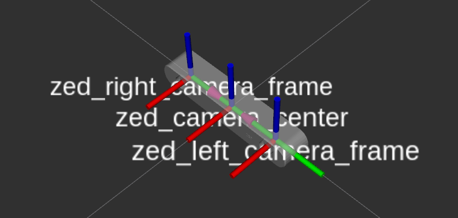
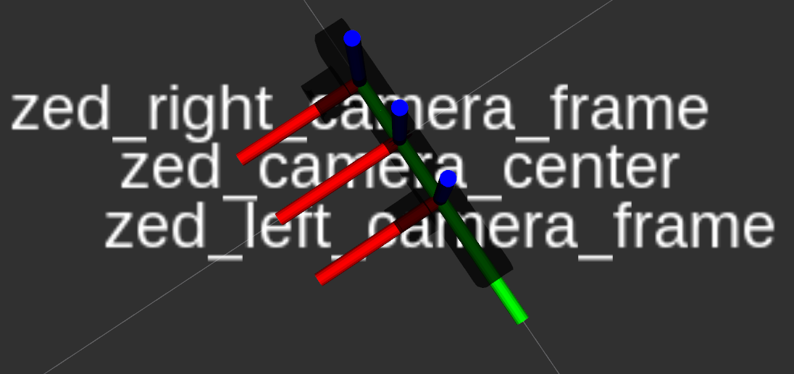

# Stereolabs ZED Camera - ROS2 Display example

This package lets you visualize in the RViz2 application all the possible information that can be acquired using a ZED camera.

### Run the program

If you own a ZED camera launch:

    $ ros2 launch stereolabs_zed_rviz display_zed.launch.py

If you own a ZED Mini camera launch:

    $ ros2 launch stereolabs_zed_rviz display_zedm.launch.py

[More](https://www.stereolabs.com/documentation/guides/using-zed-with-ros/introduction.html)
